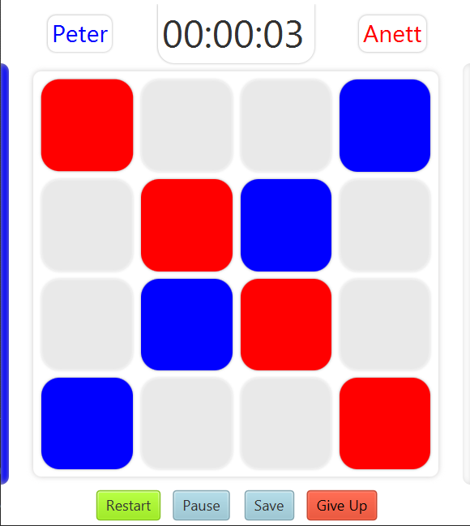
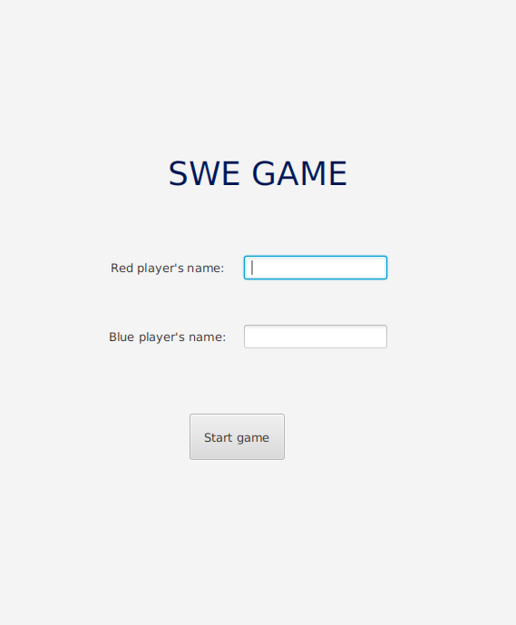
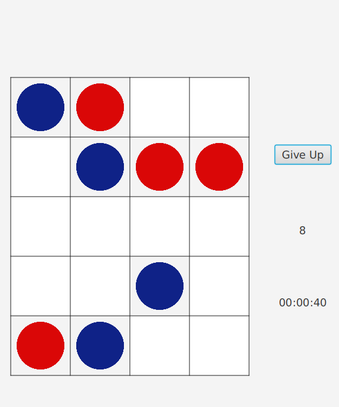
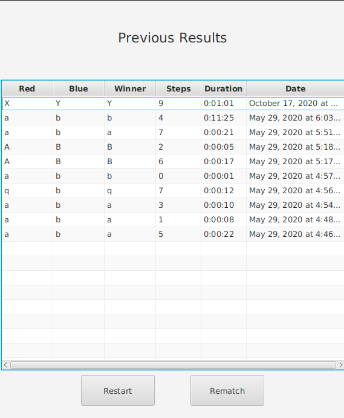
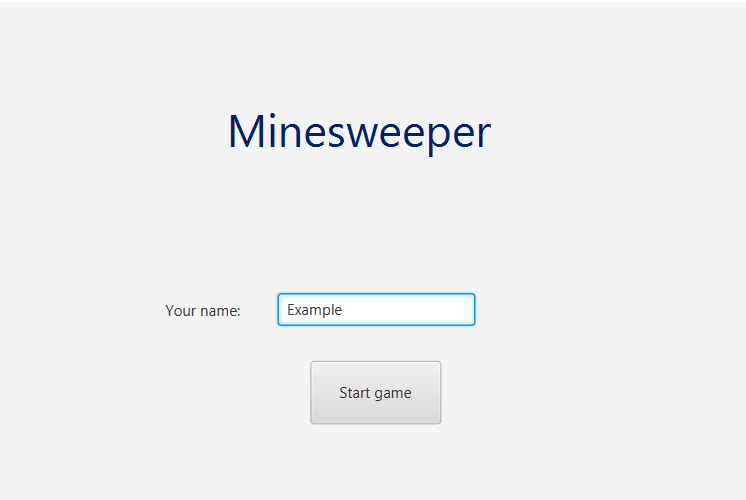
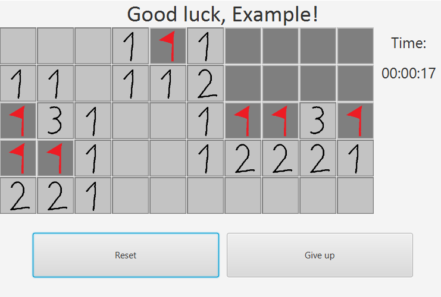
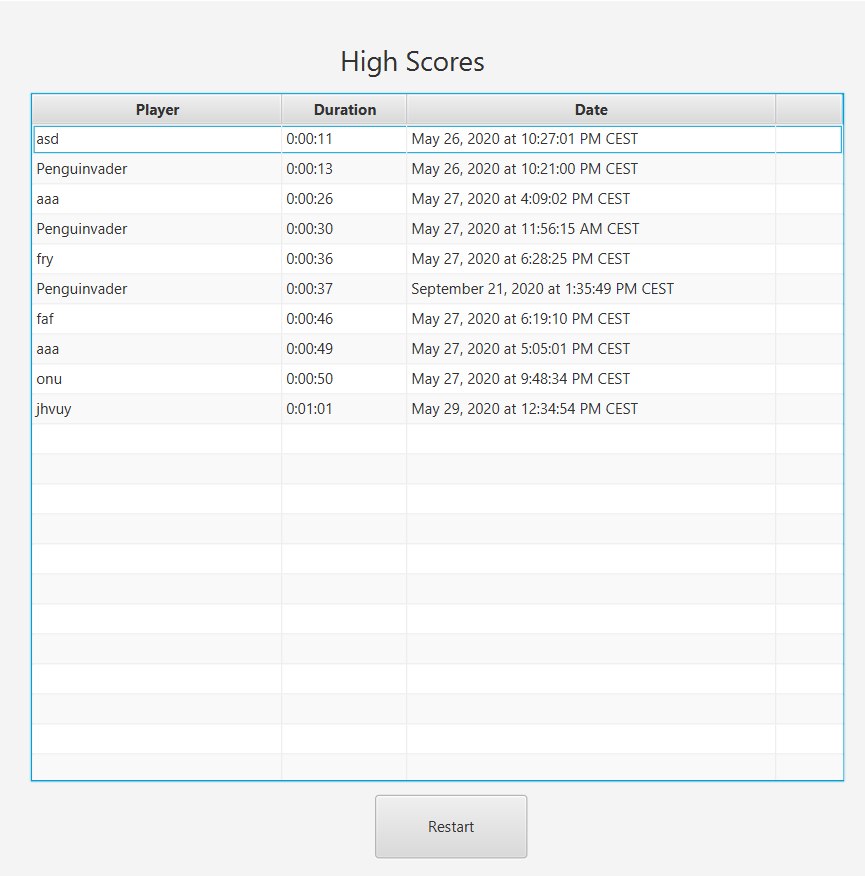
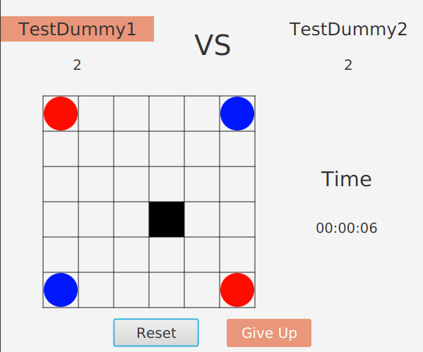

Funkcionális specifikáció
=========================

Rendszer céljai, nem céljai
---------------------------
### A rendszer célja, hogy:
- segítse a szakkörön résztvevők logikai készségeinek fejlődését.
- játékosan vezesse be a résztvevőket a szakkör tematikájába.
- csapatjátékok esetén növelje az együttműködési képességüket.
- hozzászoktassa a résztvevőket a versenyhelyzetekhez, és azok helyes kezeléséhez.
- javítsa koncentrálóképességüket.
- fejlessze a résztvevők számítógépes ismereteit.
- alternatívákat nyújtson a már jól ismert logikai játékok mellett.
- az elért eredmények egyszerűen visszakövethetőek legyenek.

### A rendszernek nem célja, hogy:
- teljes mértékben kiváltsa a szakkörön használt hagyományos társasjátékokat.
- az elért eredményeket online adatbázisba gyűjtse.
- a játékosok online tudjanak játszani egymás ellen.
- Windows mellett egyéb platformokon is tökéletes funkcionalitást biztosítson.

Jelenlegi helyzet leírása
-------------------------
A megrendelő iskola egy átlagos általános iskola, egy pályázat keretében szeretne az egyik szakkörre egy játék összeállítást készíttetni. A szakkör alapjába véve a matematikai, illetve logikai készségeket kívánja fejleszteni. A matematikai és logikai feladatokon túl a gyerekeknek mindig van a szakkör végén idő egy kis kötetlen, szabad játékra. Ezek olyan fejlesztő játékok, melyekkel a gyerekek játékosan csiszolhatják az elméjüket, és egy kis versenyszellemet is ébreszt bennük. Ilyen játékok például a sakk, malom, amőba, illetve jónéhány táblás játék és logikai társasjáték is rendelkezésükre áll (Pentago, Kabaleo, Scrabble, Fedőnevek, Aranyásók, stb...). A játékok között az egyszemélyes játékokon kívül számos páros-, és csapatjáték található, hogy az összedolgozás, csapatmunka készségek is fejlődhessenek.
Fontos célja még a szakkörnek a fiatal diákok érdeklődésének felkeltése, ezért is szeretnék, ha az egyre inkább digitális világban a gyerekek ilyen jellegű szoftvereket is használnának. Ez a digitális készségeik fejlesztéséhez is nagyban hozzájárulna, illetve a technika iránti érdeklődésükre is hatással lenne. Jelenleg több korszerű számítógép is rendelkezésünkre áll, melyek alkalmasak lennének az elkészült szoftverek használatára.

A rendszerre vonatkozó szabályok
--------------------------------
Az alkalmazást Windows operációs rendszer alatt szeretnék futtatni, korszerű gépeken. Annyi az elvárás ezzel kapcsolatban, hogy a programokat zökkenőmentesen lehessen telepíteni és használni, különösebb informatikai szaktudás nélkül is. Ennek a technikai megvalósítása a megrendelő számára lényegtelen.

A program tárolhatja a játékosok neveit (akár valódi, akár játékosnév), de más személyes adatokat nem. A játékosok játék során keletkező adatait, illetve a játékosok nevét ne tároljuk semmilyen más, külső szerveren, csak az adott iskolai számítógépen.

Jelenlegi üzleti folyamatok
----------------------------

Játék menete

Eredmények rögzítése

Bajnokság menete

Igényelt üzleti folyamatok
--------------------------

Követelménylista
----------------
- K01: Intuitív, felhasználóbarát UI
- K02: Grafikus megjelenítés
- K03: Kellemes színvilág
- K04: Eredménytárolás adatbázisban
    - Játékosnév
    - Pontszám/győztes játékos
    - Dátum
- K05: Singleplayer és multiplayer játékok
- K06: Windows operációs rendszer támogatása
- K07: Kilépés nélküli váltás játékok között
- K08: Lokális eredménytárolás

Használati esetek
-----------------
 

    

Képernyőtervek
--------------

 - A játékválasztó képernyő prototípusa
 

    

- Az első tervezett játék kezdőképernyő prototípusa

    

- Az első tervezett játék menet közbeni prototípusa

    

- Az első tervezett játék eredményjelző prototípusa

    

- A második tervezett játék kezdőképernyő prototípusa

    

- A második tervezett játék menet közbeni prototípusa

    

- A második tervezett játék eredményjelző prototípusa

    

- A harmadik tervezett játék kezdőképernyő prototípusa

    

- A harmadik tervezett játék menet közbeni prototípusa

    

- A harmadik tervezett játék eredményjelző prototípusa

    

- A negyedik tervezett játék kezdőképernyő prototípusa

    

- A negyedik tervezett játék menet közbeni prototípusa

    

- A negyedik tervezett játék eredményjelző prototípusa

    

Forgatókönyvek
--------------
<!--Benedek-->
A szakkör szabadidős részében két gyermek úgy dönt, hogy a swe-game-mel játszik pár menetet egymás ellen. Ehhez a számítógép bekapcsolása után elindítják az alkalmazást, ahol a kezdőképernyőn kiválasztják a swe-game-t. Megadják a nevüket. Feri úgy dönt, hogy ő lesz a pirossal, tehát ő kezd.  A játékosok ezután felváltva lépnek, a négy szomszédos mező egyikére.
Lépegetnek, logikáznak, mig nem egyszer csak úgy alakul az állás, hogy Feri piros korongjaiból három lesz egymás mellett. Ekkor a menet játék ér, megjelenik a Győztes neve, illetve az adatbázisból láthatjuk a legutóbbi játszmák eredményeit. A játékosok választhatnak, hogy új játszmát indítanak, vagy másik játékkal szeretnének játszani, vagy pedig inkább kilépnek az alkalmazásból.
Géza nem hagyja az állást annyiban, ezért játszanak egy visszavágót.

<!--Péter-->
A szakkör két diákja, Anett és Szilvi úgy dönt, hogy Dao game-el fognak játszani. Elindítják a szoftvert és az előválasztó menüben kiválasztják a Dao game-et. Nevük megadása után elkezdődik a játék. Amelyikük elsőnek adta meg a nevét, kék színnel játszik, a másik pedig a pirossal. Ezután felváltva lépnek a bábuikkal. Szilvi olyan mezőre szeretne lépni, ahol az ellenfél bábuja van, de a program ezt nem engedi, ezért egy másikat választ. 
Addig-addig játszanak míg nem Anett úgy lép, hogy Szilvi bábuját sarokba szorítja. Ekkor a játék véget ér, és Szilvi győz. Anett nem hagyja annyiban a dolgot, és játszanak egy újabb menetet. Ezúttal Anett jobban figyel, nem követ el buta hibát. Végül sikerül függőlegesen egy sorba állítania a bábuit, így legyőzi Szilvit.  

<!--Botond-->
A szakkör vége felé közeledve a szakkört vezető tanár elrendeli a közös játékot. Két diák, Denerisz és Aragorn úgy döntenek, hogy a PUCKG nevű korongos logikai játékkal szeretnének egymás ellen játszani. Elindítják az iskolai számítógépen a szoftvert, majd kiválasztják a játékot.
Még mielőtt beírnák a nevüket, elolvassák a szabályzatot, mert nem biztosak abban, hogy mikor is van vége a játéknak. Persze ez érthető is, még csak most játszanak másodjára a játékkal, és az előző alkalom is 2 hete volt, a tavaszi szünet miatt. Miután tisztázták a szabályokat, beírják a nevüket, és el is kezdik a játékot.
A piros játékos kezdi a játékot, és felváltva lépegetnek. Egy lépésben vagy letesznek egy új korongot egy már meglévő koronggal nyolcszomszédos helyre, vagy áthelyeznek egy meglévő korongot két pozícióval odébb átlósan függőlegesen vagy vízszintesen. Minden egyes újonnan elhelyezett korong nyolcszomszédos mezőiben lévő ellenfélhez tartozó korong átszíneződik az adott játékos színére. Ezek szerint haladnak, taktikáznak.
Már egy ideje tart a játék, amikor Aragorn rossz helyzetbe kerül, és csupán három korongja marad a pályán, azok is egymás mellett. Denerisz pedig ki is használja ezt, és egy korongját áthelyezve megnyeri a játékot, lenullázva Aragorn korongjainak számát.
Aragorn persze nem hagyja magát, visszavágót kér, és meg is nyeri a második játszmát.
Sajnos ekkor véget a szakkör, így megegyeznek egy igazságos döntetlenben, és kilépnek a játékból.

<!--Balázs-->
A szakkörön aknakereső bajnokságot hirdetnek ki, melyen Tomi részt vesz.
Amikor az ő köre van, megnyitja a programot, és kiválasztja a játékválasztó menüben a Minesweeper játékot, majd megadja felhasználónevét, és a start gombra nyom.
Egy négyzetrácson bal- vagy jobbkattintással léphet interakcióba Tomi a mezőkkel. A bal kattintással felfedi az aktuális mezőt, a jobb kattintás pedig egy zászlót rak le, mellyel jelezheti, hogy ott azt sejti, akna van.
Minden felfedett mezőn látszik, hogy mennyi akna van az azzal szomszédos, vagy közvetlenül átlós mezőkön, és Tomi ez alapján kitalálja, melyik mezők tartalmaznak aknát.
Ha az adott mező felfedésekor nincs körülötte egyetlen akna sem, a mellette lévő mezők automatikusan felfedésre kerülnek, 8 triviális kattintást megelőzve.
Tomi bal klikkel kattint egy zászlóra a mellette lévő rejtett mező helyett, viszont véletlen félrekattintást megelőzve a zászlós mezőket nem lehet felfedni, hiszen azért jelölte be őket, mert azt sejti, akna van rajtuk, melyekre kattintva azonnal veszítene.
Mikor a pálya minden olyan zónája, melyen nincs bomba, felfedésre kerül, Tomi megnyerte a játékot, és idője az adatbázisba kerül, ami mindössze 30 másodperc volt.
Ezután Tomi kilép a játékból, és átadja a rákövetkező játékosnak.
A bajnokság végén, mikor mindenki játszott, Tomi lett az első helyezett, mert 1 próbálkozással, 30 másodperc alatt fejtette meg a játékot.

Funkció-követelmény megfeleltetés
---------------------------------
- K01: Az intuitív user interface megvalósítását az fxml fájlok megfelelő layoutjával, és a kép assetek letisztult designjával tesszük meg.
- K02: A grafikus megjelenítést a JavaFX platform segítségével tesszük meg, melyet interaktív GUI tervezésére alkalmazunk.
- K03: A színvilág beállítása CSS segítségével történik, melyet az fxml-hez rendelve tetszőleges színűvé tehetjük az elemeket.
- K04: Az adatbáziskezelést SQL-el tesszük, ami a Java-n belül a H2 adatbáziskezelő rendszerrel történik.
- K05: A többszemélyes játékokat un. "hot seat" módon tesszük, mely során a körökre osztott játék játékosai felváltva lépnek, ugyanazon a gépen. 

Fogalomszótár
-------------
- __H2 adatbázis__: Egy egyszerű nyílt forráskódú relációs adatbáziskezelő rendszer, mely Java nyelven lett megírva. Első kiadása 2005-ben jelent meg. Használata nagyon intuitív és kiválóan alkalmas egyszerűbb alkalmazások, játékok eredményeinek eltárolására.
*Bővebben: [https://en.wikipedia.org/wiki/H2_(DBMS)](https://en.wikipedia.org/wiki/H2_(DBMS))*

- __Hibernate__: Olyan programkönyvtár, mely a program objektumai és az adatbázistábla rekordjai közti átjárást segíti. Lehetőséget biztosít arra, hogy a programunkban lévő objektumokat át tudjuk alakítani rekordokká, és viszont. Ennek jelentősége abban rejlik, hogy jelentősen megkönnyíti a programozók munkáját, ugyanis azoknak nem szükséges beható SQL ismeretekkel rendelkezniük. A szükséges a SQL lekérdezéseket a Hibernate automatikusan legenerálja. Sima Java programokhoz is használható, de főleg a Java EE (2019 óta Jakarta EE) környezetben használják.
*Bővebben: [https://hu.wikipedia.org/wiki/Hibernate](https://hu.wikipedia.org/wiki/Hibernate)*

- __Java__: Objektumorientált programozási nyelv. melyet a Sun Microsystem fejlesztett ki. Az első kiadása 1995-ben jelent meg. A Sun Microsystems felvásárlását követően a 2009-től kezdve az Oracle biztosít hozzá támogatást. Népszerűsége mind a mai napig töretlen, hiszen egyike a legelterjedtebb programozási nyelveknek. Segítségével könnyen megvalósítható a platformfüggetlenség, ugyanis a Java programok egy virtuális gépen, a JVM-en futnak. 
*Bővebben: [https://hu.wikipedia.org/wiki/Java_(programozási_nyelv)](https://hu.wikipedia.org/wiki/Java_(programoz%C3%A1si_nyelv))*

- __JavaFX (OpenJFX)__: Olyan programkönyvtár melynek segítségével kliens oldali asztali alkalmazásokat lehet készíteni, melyet 2008-ban fejlesztett ki a Sun Microsystems. Lényegében a Java Swing-et helyettesíteni hivatott GUI könyvtár. Előnye, hogy platformfüggetlen, elérhető Windows, Linux és macOS operációs rendszereken, valamint Anroid-on, iOS-en és webböngészőkben is. 2011-ig a Java JDK része volt, azóta az OpenJFX projekt keretében érhető el. Segítségével a modell-nézet-vezérlő architektúrális minta implementálása könnyen megvalósítható. A felhasználói felületet egy XML szerű fxml fájl írja le. Annak könnyebb szerkeszthetősége érdekében készítette el a Gluon cég a [Scene Builder](https://gluonhq.com/products/scene-builder/) szoftvert.
*Bővebben: [https://en.wikipedia.org/wiki/JavaFX](https://en.wikipedia.org/wiki/JavaFX)*

- __JDBC__: Egy alkalmazás programozási interfész (API), melynek segítségével relációs adatbázisokhoz tudunk csatlakozni. Tartalmazza a szükséges osztályokat és metódusokat ahhoz, hogy lekérdezéseket és módosításokat tudjunk végrehajtani az adatbázisban. Kifejezetten a Java programozási nyelvhez készült, Java nyelven.
*Bővebben: [https://hu.wikipedia.org/wiki/Java_Database_Connectivity](https://hu.wikipedia.org/wiki/Java_Database_Connectivity)* 

- __Maven__: Szoftver, melyet szoftvermendzselésre és build folyamat automatizálására fejlesztettek ki. Az első verziója 2002-ben jelent meg Jason van Zyle által és jelenleg az Apache Software Foundation által érhető el. A build-elési folyamatot, valamint az ahhoz szükséges függőségeket a POM fájl tartalmazza. Nagy előnye a Maven-nek, hogy a függőségeket automatikusan letölti a központi tárolóból, és elérhetővé teszi azt a szoftver számára a classpath-ban. Főleg Java programokhoz szokták használni, de elérhető például C++ projektekhez is. A Java programozási nyelvhez hasonlóan ez is platformfüggetlen.
*Bővebben: [https://hu.wikipedia.org/wiki/Apache_Maven](https://hu.wikipedia.org/wiki/Apache_Maven)*

- __Platformfüggetlen__: A platformfüggetlen programok általában Windows, Linux és macOS operációs rendszereken érhetőek el. Hasonló fogalom a többplatformosság, mely annyit jelent, hogy a szoftver egynél több platformon érhető el. Fejlesztői szempontból azért előnyös így elkészíteni egy programot, mert a program forrása azonos tud maradni, nem kell jelentősen átírni egy esetleges jövőbeli platformbővítés esetén.
*Bővebben: [https://hu.wikipedia.org/wiki/Platformfüggetlenség](https://hu.wikipedia.org/wiki/Platformf%C3%BCggetlens%C3%A9g)*