Rendszerterv
============
A rendszer célja
----------------
A rendszer legfőbb célja, hogy segítse a szakkörön résztvevők logikai készségeinek fejlődését. Az alkalmazás játékos formában támogassa a szakkör tematikáját, ezzel a résztvevők érdeklődésének felkeltését hivatott szolgálni. A többszemélyes játékok célja többek között az egészséges versenyszellem ébresztése a diákokban, míg a csapatjátékok (vagy ha egy kétszemélyes játékot csapatban játszanak) esetén a tanulók összedolgozási, illetve együttműködési képességének a fejlesztése.

Cél továbbá a felhasználók hozzászoktatása a versenyhelyzetekhez, és azok kezeléséhez. Ez a játékok kompetitív jellegéből adódik, és továbbá fejleszti a tanulók koncentrálóképességét.

Az elért eredményeket fontos nyomon követni, hogy a diákok számon tarthassák korábbi eredményeiket. Ugyanakkor ehhez egy játékosnéven túl semmilyen személyes információt, adatot nem hivatott az alkalmazás tárolni, csupán a játékra vonatkozó legfontosabb adatokat. A rendszerre vonatkozó szabályoknak megfelelően az alkalmazás nem tárolhat semmit az adott iskolai gépen kívül.

A mai fiataloknak az egyre inkább digitális világban nagyon fontos, hogy elsajátítsák a modern technika helyes és hasznos használatát. A program ehhez is hozzájárul, illetve a technika iránti érdeklődést is növelni hivatott. A használatával a tanulók fejleszthetik számítógépes ismereteiket.

A rendszer célja továbbá az egyszerű, zökkenőmentes működés biztosítása, mivel a felhasználók nagy része nem rendelkezik különösebb informatikai szaktudással. A program Windows operációs rendszer alatt kell, hogy fusson. Ehhez korszerű gépek állnak a megrendelő rendelkezésére. Ugyancsak cél a telepítés, illetve karbantartás komplexitásának minimalizálása is.

Ezen felül a rendszernek célja, hogy a szakkörön meglévő játékokat inkább kiegészítse, mintsem helyettesítse.

Projekt terv
------------
A projektben 4 fő dolgozik:
- Bartha Balázs
- Fürjes-Benke Péter
- Szabó Benedek
- Mezei Botond

A munkások szerepkörei hasonlóak. Ezek a következőek:
- Specifikációk leírása
- Játékok állapottér-reprezentációjának létrehozása
- Játékok grafikus user interface tervezése
- Játékok JavaFX kontrollereinek megírása
- Adatbáziskezelés
- Tesztelés

Ütemterv:
- 2020 November 2.: Specifikáció, rendszerterv tervezett befejezése
- 2020 November 9.: Demo verzió bemutatásra való előkészítése
- 2020 November 30.: Végleges verzió bemutatásra való előkészítése

Mérföldkövek:
- Demo bemutatása
- Projekt befejezése

Üzleti folyamatok modellje
--------------------------
<p align="center">A kiváltandó üzleti folyamatok modellje</p>

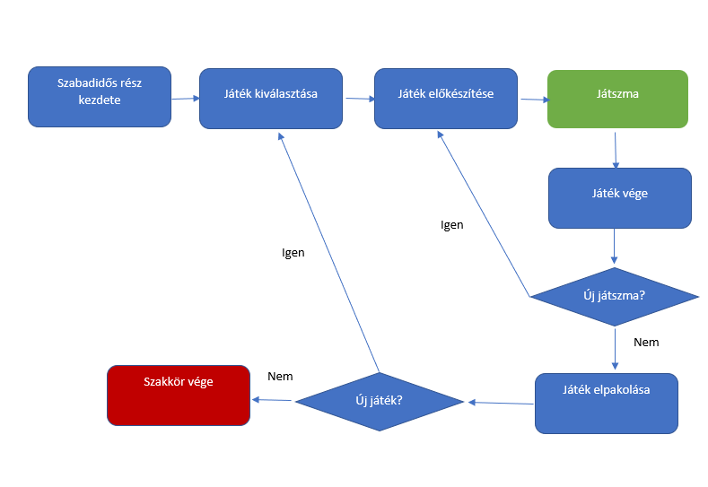


A támogatandó üzleti folyamat a gyermekek logikai készségeinek a fejlődése. A szakkör alapjába véve a matematikai, illetve logikai készségeket kívánja fejleszteni. A matematikai és logikai feladatokon túl a gyerekeknek mindig van a szakkör végén idő egy kis kötetlen, szabad játékra. Ezek olyan fejlesztő játékok, melyekkel a gyerekek játékosan csiszolhatják az elméjüket, és egy kis versenyszellemet is ébreszt bennük. Ilyen játékok például a sakk, malom, amőba, illetve jónéhány táblás játék és logikai társasjáték is rendelkezésükre áll (Pentago, Kabaleo, Scrabble, Fedőnevek, Aranyásók, stb...). A játékok között az egyszemélyes játékokon kívül számos páros-, és csapatjáték található, hogy az összedolgozás, csapatmunka készségek is fejlődhessenek. Fontos célja még a szakkörnek a fiatal diákok érdeklődésének felkeltése, ezért is szeretnék, ha az egyre inkább digitális világban a gyerekek ilyen jellegű szoftvereket is használnának. Ez a digitális készségeik fejlesztéséhez is nagyban hozzájárulna, illetve a technika iránti érdeklődésükre is hatással lenne. Jelenleg több korszerű számítógép is rendelkezésünkre áll, melyek alkalmasak lennének az elkészült szoftverek használatára.

<p align="center">A tervezett üzleti folyamatok modellje</p>

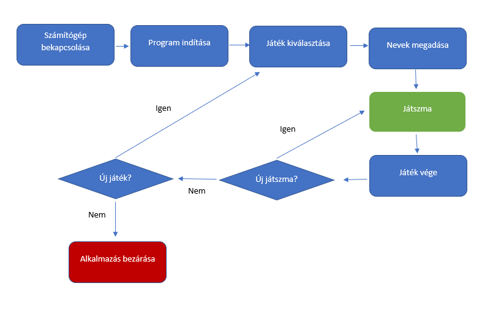

Követelmények
-------------
### Funkcionális követelmények
- K01: Eredménytárolás adatbázisban
    - Játékosnév, Pontszám/Győztes és Dátum tárolása
    - mindenkori TOP 5 eredmény tárolása külön táblában a bajnokságok segítése érdekében
    - az összes korábbi eredmény törlésének biztosítása, leszámítva a Top 5 eredményt tartalmazó táblát
- K02: Játékok közötti váltás lehetőségének biztosítása egy központi felületen keresztül
    - a program indításakor ez a központi felület kell, hogy köszöntse a felhasználót
    - a programnak futási időben kezelnie kell a játékok közötti váltást
- K03: Aktuális játék újraindításának lehetősége
    - az újraindítás során a korábbi játékos nevet/neveket kell használni az új játszmához
- K04: Grafikus megjelenítés
    - programnak kötelezően rendelkeznie kell grafikus felhasználói felülettel
- K05: Egyszemélyes és többszemélyes játékok biztosítása
    - fontos, hogy mind a két kategóriából tartalmazzon legalább egy játékot a csomag

### Nemfunkcionális követelmények
- K01: Intuitív, felhasználóbarát UI
    - a grafikus felhasználói felületnek könnyen kezelhetőnek kell lennie
    - a használatához szükséges tudás elsajátítása nem lehet hosszabb 1-2 percnél
- K02: Kellemes színvilág
    - a program színvilágának olyannak kell lennie, hogy a diákok figyelmét felkeltse
    - fontos szempont, hogy ne legyen megterhelő a felhasználó szemének hosszabb játszmák során sem
- K03: Windows operációs rendszer támogatása
    - programnak Windows 7 és Windows 10 operációs rendszereket kell támogatnia
- K04: Program megbízható működése rejtélyes hibák, fagyások nélkül
    - az átadáskor a programnak stabilan kell működnie, csak optimalizációs problémák
    - nem fordulhat elő olyan, hogy játék közben hibával terminál a program
- K05: Az eredmények lokális tárolása
    - a játékok során gyűjtött adatokat nem szabad távoli szerveren tárolni, kizárólag azon a számítógépen, melyen telepítve van a programcsomag

### Törvényi előírások
- K01: GDPR szabályok betartása
    - a játékok során gyűjtött adatok minden esetben a GDPR-nak megfelelően kell kezelni

Funkcionális terv
-----------------
### Képernyőtervek

 #### A játékválasztó képernyő prototípusa
 <p align="center">
    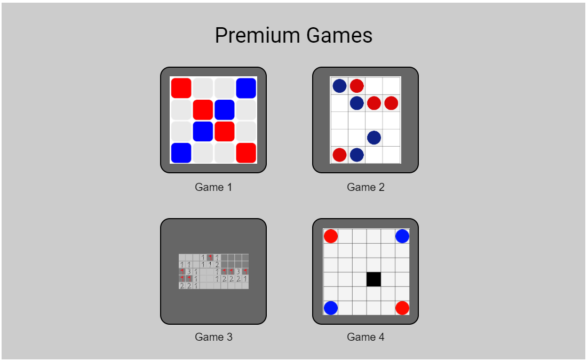
</p>

- Elemek:
    - Cím
    - Játékválasztó gombok

#### Az első tervezett játék kezdőképernyő prototípusa
<p align="center">
    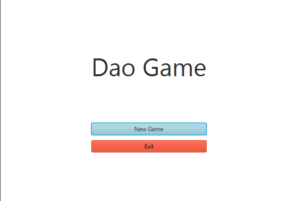
</p>

- Elemek:
    - Cím
    - Új játék gomb
    - Kilépés gomb

#### Az első tervezett játék menet közbeni prototípusa
<p align="center">
    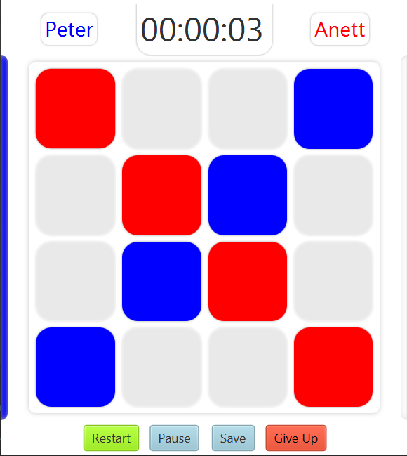
</p>

- Elemek:
    - Játékosnevek
    - Időmérő
    - Játéktér
    - Újrakezdés gomb
    - Pause gomb
    - Mentés gomb
    - Feladás gomb

#### Az első tervezett játék eredményjelző prototípusa
<p align="center">
    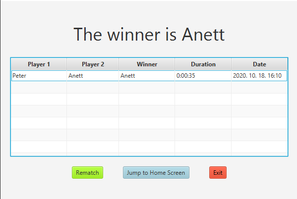
</p>

- Elemek:
    - Győztes játékos
    - Eredménytáblázat
    - Visszavágó gomb
    - Főmenü gomb
    - Kilépés gomb

#### A második tervezett játék kezdőképernyő prototípusa
<p align="center">
    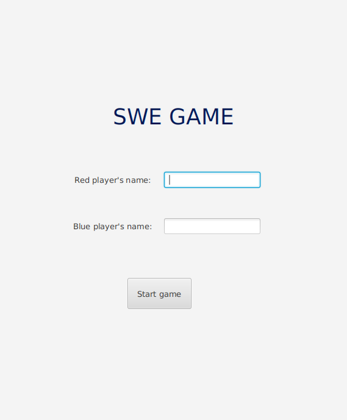
</p>

- Elemek:
    - Cím
    - Névmegadó szövegdobozok
    - Indító gomb

#### A második tervezett játék menet közbeni prototípusa
<p align="center">
    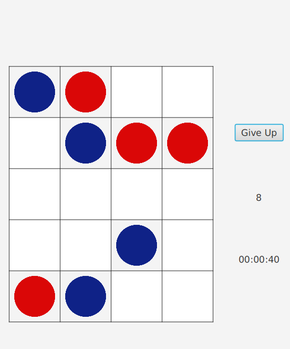
</p>

- Elemek:
    - Időmérő
    - Játéktér
    - Lépésszám
    - Feladás gomb

#### A második tervezett játék eredményjelző prototípusa
<p align="center">
    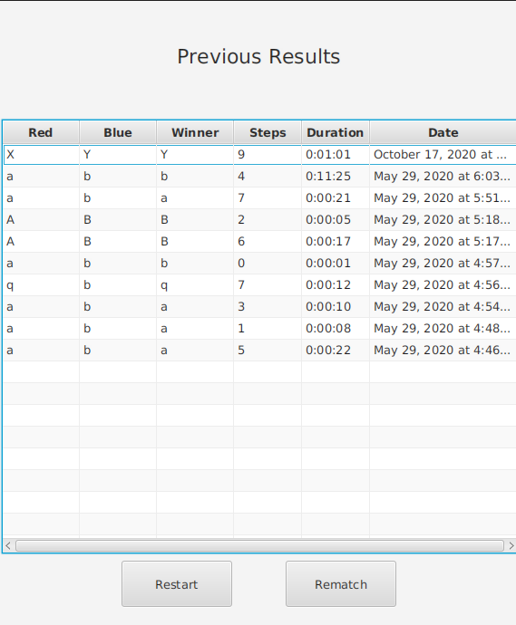
</p>

- Elemek:
    - Eredménytáblázat
    - Visszavágó gomb
    - Újrakezdés gomb

#### A harmadik tervezett játék kezdőképernyő prototípusa
<p align="center">
    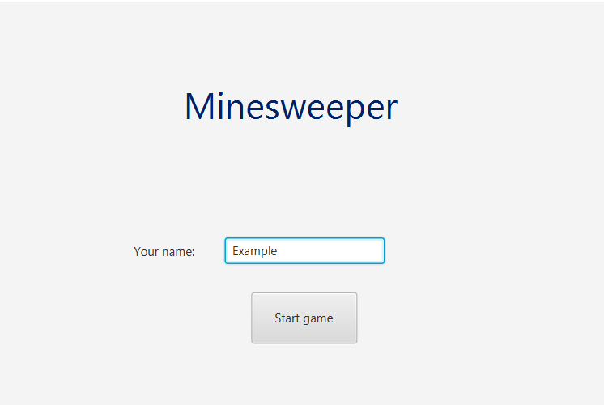
</p>

- Elemek:
    - Cím
    - Névmegadó szövegdoboz
    - Indító gomb

#### A harmadik tervezett játék menet közbeni prototípusa
<p align="center">
    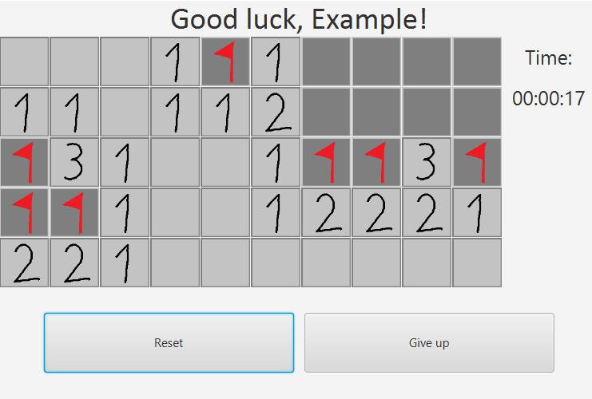
</p>

- Elemek:
    - Időmérő
    - Játéktér
    - Újrakezdés gomb
    - Feladás gomb

#### A harmadik tervezett játék eredményjelző prototípusa
<p align="center">
    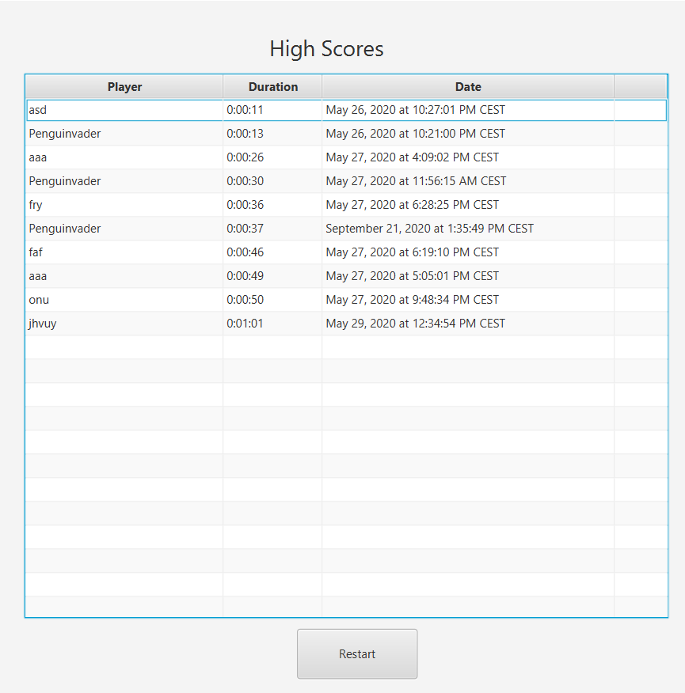
</p>

- Elemek:
    - Eredménytáblázat
    - Újrakezdés gomb

#### A negyedik tervezett játék kezdőképernyő prototípusa
<p align="center">
    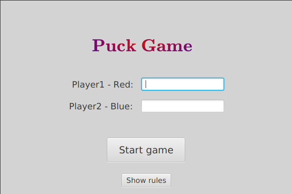
</p>

- Elemek:
    - Cím
    - Névmegadó szövegdobozok
    - Indító gomb
    - Szabálymegtekintés gomb

#### A negyedik tervezett játék menet közbeni prototípusa
<p align="center">
    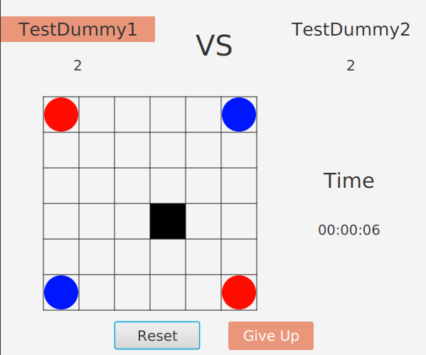
</p>

- Elemek:
    - Játékosnevek
    - Időmérő
    - Játéktér
    - Pontszámok
    - Feladás gomb
    - Újrakezdés gomb

#### A negyedik tervezett játék eredményjelző prototípusa
<p align="center">
    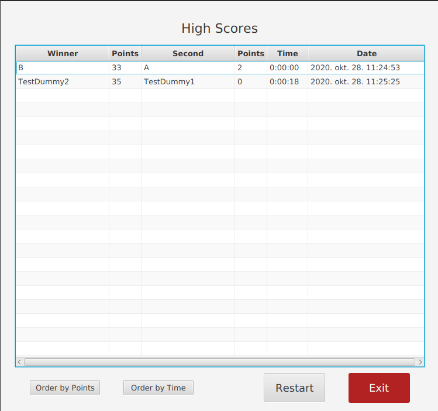
</p>

- Elemek:
    - Eredménytáblázat
    - Újrakezdés gomb
    - Kilépés gomb
    - Rendező gombok

### Menü hierarchiák
<p align="center">
    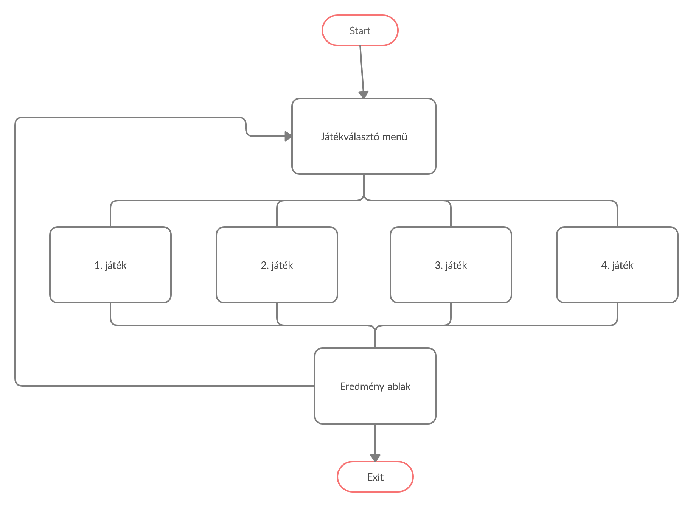
</p>

### Használati esetek levezetése:

#### Eredmények megtekintése:
Program elindítása &rarr; Eredménylista megnyitása &rarr; Játék kiválasztása &rarr; Eredmény megtekintése

#### 2 fős játék indítása:
Program elindítása &rarr; 2 fős játék kiválasztása &rarr; Nevek megadása &rarr; Játék kezdése &rarr; Játék befejezése

#### 1 fős játék indítása:
Program elindítása &rarr; 1 fős játék kiválasztása &rarr; Név megadása &rarr; Játék kezdése &rarr; Játék befejezése

Fizikai környezet
-----------------
A szoftver Java nyelven, a JavaFX platform igénybe vételével kerül fejlesztésre.

Hálózati kapcsolatot nem alkalmaz a program, mindent lokális adatbázisban tárol.

Vásárolt komponenseket nem tartalmaz a szoftver, teljesen ingyenes, nyílt forrásokból dolgozunk.

Fejlesztéshez az IntelliJ IDEA integrált fejlesztői környezetet használjuk.

Az alkalmazás, mivel a Java platformfüggetlen, bármilyen platformon, melyre Java van telepítve, működik, de a célplatform a Windows, így a fejlesztés, tesztelés is ezen az operációs rendszeren történik.

A projekt összeállításához a Maven projektkezelő eszközt használjuk.

Absztrakt domain modell
-----------------------

<p align="center">
    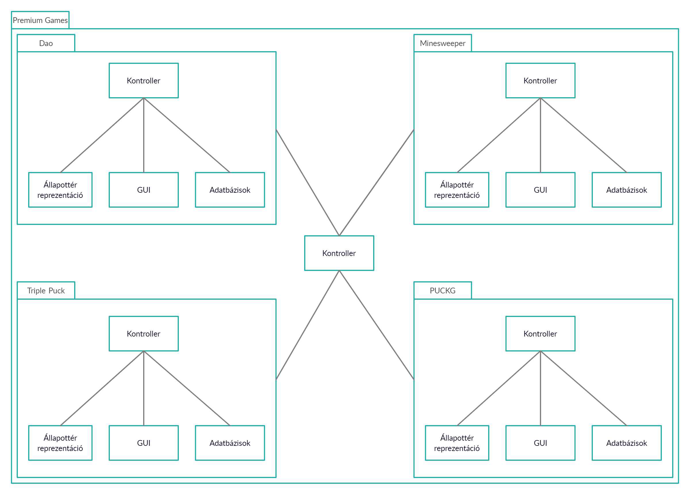
</p>

A szoftver magját 4 játék képezi. Ezek között van egy- és többjátékos is. A játékokhoz külön-külön adatbázisok tartoznak. Szám szerint játékonként kettő.

A két adatbázis felépítésében, modelljében azonos, azonban funkcionalitásában, felhasználásában eltér. A különbség, hogy míg az egyik adatbázis törölhető, a másik egy mindenkori toplistát tartalmaz, ami már nem lesz törölhető. A törölhető adatbázis lényege, hogy lehetőséget biztosítson kis szakköri bajnokságok lebonyolítására, az eredmények tárolására.

A játékok működése és eredménytárolása teljesen független egymástól. Az összekapcsoló elem lényegében a szoftver kezdőképernyője. Innen lehet majd a játékokat elindítani.

Architektúrális terv
--------------------

Az tervezés az MVC architektúrális minta szerint történik. A játékok modellje az állapottérreprezentáció, a JavaFX-ben készített felhasználói felülettel pedig a kontrollerek fogják végezni.

**Komponensek**
 - játékok állapottérreprezentációi
 - szükséges adatbázisok (játékonként 2)
 - felhasználói felületek a játékokhoz
 - közös irányítófelület
 - kontrollerek, az állapottér és a felhasználói felület összeköttetése érdekében

**Változások kezelése és bővíthetőség**

A változások kezelése e szoftver esetén új játékok hozzáadásával történhet vagy a jelenlegiek módosításával. Mivel ezek a játékok egymástól teljes mértékben függetlenek, így az ilyen változtatások könnyen, gördülékenyen kivitelezhetők.

**Biztonsági funkciók**

Mivel egy belsős felhasználású, csupán játékokat tartalmazó szoftverről beszélünk, melyek internetes adatforgalmat semmilyen szinten sem generálnak, illetve a tárolt adatok sem érzékenyek, így nem szükséges magas szintű biztonsági funkciók beépítése.

Adatbázis terv
--------------
Az eredmények tárolásához egy H2 adatbázis lesz használva annak gyorsasága és open source jellege miatt. A felemerülő igények kielégítéséhez bőven elegendő a tudása és nem elhanyagolható szempont az alacsony rendszerigénye.
A játékok eredményeit külön-külön adatbázis táblában fogja tárolni a program,melyek esetén lehetőség lesz a teljes törlésre. Ezen felül minden játékhoz tartozni fog egy a legjobb 5 eredményt tároló tábla is, melyet nem lehet majd törölni. Előbbi táblák a bajnokságok nyomon követéséhez lesznek ideálisak, utóbbiak pedig a diákok versenyszellemét hivatottak fenntartani.

### Logikai modell
<p align="center">
    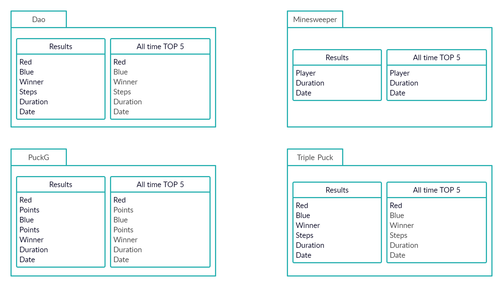
</p>

### Tárolt eljárások
A jelenlegi igények mellett nincs szükség tárolt eljárások létrehozására. Egy esetleges továbbfejlesztés esetén újra mérlegelve lesz használatuk.

### Fizikai adatmodellt legeneráló SQL script
Az adatmodellek létrehozásához szükséges szkripteket a Hibernate programkönyvtár fogja legenerálni a DAO osztályoknak megfelelően. A jelenlegi logikai adatmodell alapján a következő SQL utasításokra lenne szükség:
```sql
CREATE TABLE DAO_RESULTS (
    RED VARCHAR(40),
    BLUE VARCHAR(40),
    WINNER VARCHAR(40),
    STEPS INT,
    DURATION TIME,
    DATE TIMESTAMP
);

CREATE TABLE DAO_ALL_TIME_TOP_50 (
    RED VARCHAR(40),
    BLUE VARCHAR(40),
    WINNER VARCHAR(40),
    STEPS INT,
    DURATION TIME,
    DATE TIMESTAMP
);
```

```sql
CREATE TABLE MINESWEEPER_RESULTS (
    PLAYER VARCHAR(40),
    DURATION TIME,
    DATE TIMESTAMP
);

CREATE TABLE MINESWEEPER_ALL_TIME_TOP_50 (
    PLAYER VARCHAR(40),
    DURATION TIME,
    DATE TIMESTAMP
);
```

```sql
CREATE TABLE TRIPLE_PUCK_RESULTS (
    RED VARCHAR(40),
    BLUE VARCHAR(40),
    WINNER VARCHAR(40),
    STEPS INT,
    DURATION TIME,
    DATE TIMESTAMP
);

CREATE TABLE TRIPLE_PUCK_ALL_TIME_TOP_50 (
    RED VARCHAR(40),
    BLUE VARCHAR(40),
    WINNER VARCHAR(40),
    STEPS INT,
    DURATION TIME,
    DATE TIMESTAMP
);
``` 

```sql
CREATE TABLE PUCKG_RESULTS (
    RED VARCHAR(40),
    RED_POINTS INT,
    BLUE VARCHAR(40),
    BLUE_POINTS INT,
    WINNER VARCHAR(40),
    DURATION TIME,
    DATE TIMESTAMP
);

CREATE TABLE PUCKG_ALL_TIME_TOP_50 (
    RED VARCHAR(40),
    RED_POINTS INT,
    BLUE VARCHAR(40),
    BLUE_POINTS INT,
    WINNER VARCHAR(40),
    DURATION TIME,
    DATE TIMESTAMP
);
``` 

Implementációs terv
-------------------
A szoftver az MVC architektúrális minta szerint lesz elkészítve. Ennek megfelelően 3 rétegre bontható a szerkezete: modell, nézet, vezérlő. A grafikus felhasználói felülethez a JavaFX lesz használva, mellyel tökéletesen megvalósítható a 3-as tagolás. Az egyes játékok külön csomagokban lesznek, a jobb elkülönítés érdekében.

### Perzisztencia osztályok
A csomagban található minden egyes játék külön DAO osztállyal fog rendelkezni. Ezen osztályok segítségével tárolva lesznek az egyes játszmák eredményei. Ezen felül mindegyikhez tartozni fog egy osztály, melyet a DAO osztályon keresztül fog a program az adatbázisban eltárolni. Mindegyik ilyen osztály rendelkezik a játékosok és a győztes neveinek, valamint a játék idejének tárolásához szükséges változókkal. Emellett a ``Dao`` és a ``Triple Puck`` játékok esetén összlépésszám is tárolva lesz, a ``PuckG``-hoz tartozó DAO osztálya pedig az egyes játékosok bábúinak számát tároló tagváltozókkal is rendelkezik.

### Üzleti logikai osztályai
Mindegyik játék csomagja tartalmazni fog egy az adott játék szabályait implementáló állapottér reprezentációt. Ezek leírják a játékok kezdő állását és azok végállásait, valamint azokat az operátorokat, melyek a szabályoknak megfelelően egyik állásból a másikba visznek át.

### Kliens oldal osztályai (Vezérlők)
Az egyes ``fxml`` nézetek rendelkezni fognak vezérlő osztályokkal, melyek a felhasználói interakciókat hivatottak kezelni. Mindegyik játék esetén 3 nézet lesz, ennek megfelelően 3 kontroller osztály. Az első nézet az üdvözlő képernyő, majd a játéktér nézete, végül pedig az eredményeket ábrázoló nézet. A szoftver ezen felül rendelkezni fog egy fő nézettel, melyen keresztül lehet majd választani a játékok között.

<p align="center">
    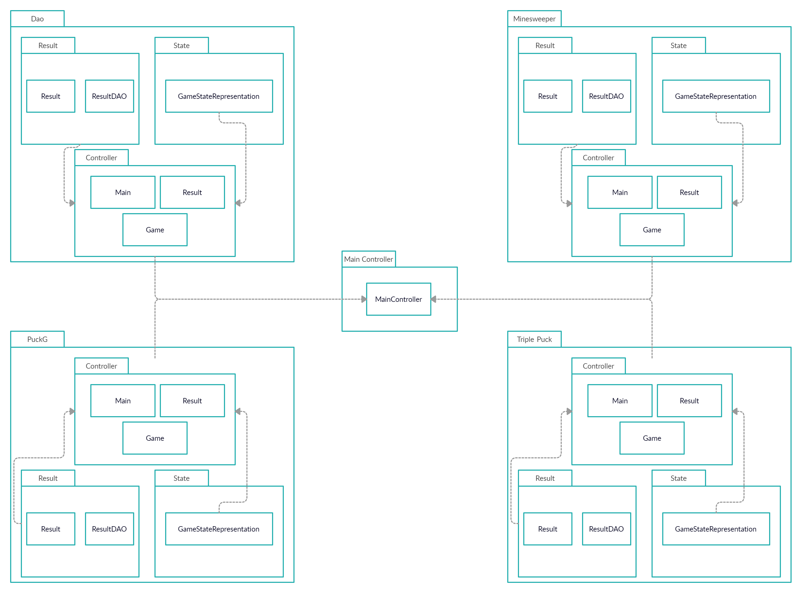
</p>

Tesztterv
---------
A tesztelésnek 2 fázisa szükséges. Első körben a forráskódszintű tesztelés folyamata megy végbe JUnit tesztek segítségével. Majd a gyakorlati tesztelés esetében pedig azt fogjuk vizsgálni, hogy az elkészült játék a lefektetett szabályok szerint minden esetben megfelelően működik, a játék kipróbálás, többszöri végigjátszása segítségével.

**Forráskódszintű tesztelés**: A tesztelés során a játékok alapját képező állapottér reprezentáció helyességét teszteljük. Azt, hogy az adott osztályokbeli függvények visszatérési értéke, működése megegyezik az elvárttal. A PUCKG esetében a következő esetekre kell odafigyelni:
 - a tábla konstruktorának megfelelő működése,
 - adott tábla konfiguráció helyessége,
 - a tábla állapotának alapján vége van-e a játéknak,
 - adott koronghoz elérhető-e olyan pozíció, amibe lehetséges a mozgatás,
 - adott korong mozgatható-e a megadott új pozícióba,
 - az üres cellák száma (fontos a játék végének eldöntése céljából),
 - adott cella üres-e (korong mozgathatóságának eldöntése miatt),
 - a mozgatás sikeressége,
 - új korong elhelyezésének lehetősége,
 - új korong elhelyezésének sikeressége,
 - adott lépés utáni műveletek sikeressége,
 - adott játékos pontjainak helyes kiszámolása.

**Gyakorlati tesztelés**: A gyakorlati tesztelés folyamata a játékok többszöri végigjátszásából áll. Ez szintén a PUCKG esetén a következőképpen alakul:
 - teszteljük, hogy mindig a lépni következő játékos van kiemelve,
 - teszteljük, hogy minden lépés után látható a pontszámok frissülése,
 - teszteljük, hogy ha egy korongot áthelyezés céljából kijelölünk, akkor a kijelölés vizuálisan is láthatóvá válik (a cella hátterének elsötédedésével),
 - amennyiben véget ér a játék, a képernyőn megjelenik az eredményjelző tábla,
 - az eredményjelző táblánál az adott rendezések meg is valósulnak-e,
 - adott képernyőváltások megfelelően mennek-e végbe.

Telepítési terv
---------------
A megrendelő kívánsága szerint elkészített, megfelelően letesztelt alkalmazás az iskola saját rendszerének adminisztrátorainak, rendszergazdáinak kerül majd átadásra, akik elvégzik annak telepítését a kívánt iskolai számítógépekre.

Karbantartási terv
------------------
A karbantartás 2 részből áll az elkészítendő szoftver esetében. Egyrészről az esetlegesen felmerülő hibák javításának tervéről, másrészről pedig a szoftver bővítésének tervéről.

**Hibajavítási terv**: Amennyiben a szoftver átadását követően, a használat során bármilyen nemű hiba lép fel, a javítás a következő lépések szerint történik:

1. A hiba felfedezését követő legrövidebb időn belül a fejlesztők megkezdik annak feltárását, javítása.
2. A javítás elkészültével egy rövid tesztelési folyamaton megy át a javított szoftver.
3. Majd a kész szoftver díjmentesen újratelepítésre kerül az iskola számítógépein.

**Szoftverfrissítési terv**: Amennyiben az átadást követően a vásárló részéről új játékkal való bővítés igénye merülne fel, úgy az a következő lépések szerint történne:

1. Egy közös egyeztetés folyamán felmérjük az igényeket.
2. Az igényfelmérés alapján elkészítjük az árajánlatot és a pontos rendszertervet.
3. Ennek elfogadását követően megkezdődik az új játék fejlesztése, tesztelése
4. A tesztelés lezárultával pedig telepítjük a frissített szoftvereket az iskola számítógépeire.
